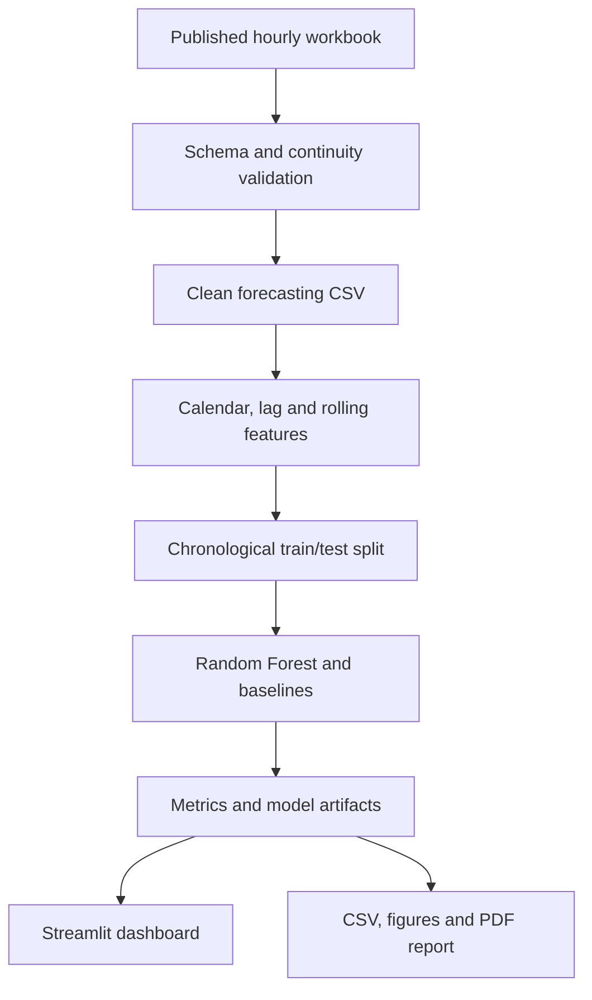

# AI-Based Load Forecasting for Microgrids

## Final-Year B.Tech Project Report

**Department:** Electrical Engineering  
**Institute:** G H Raisoni College of Engineering and Management, Wagholi, Pune  
**Academic Year:** 2026-27  
**Students:** Buddhank Vijay Jadhao (08), Khanderao Kamle (15), Kavya Pandey (14)  
**Guide:** Mrs. Ashwini Ramakant Sali

## Abstract

Microgrids integrate localized loads, distributed generation, storage, and grid connections. Their operation benefits from a reliable estimate of upcoming electrical demand. This project develops a complete software system for short-term active power load forecasting using a Random Forest regressor. The implementation uses 8,760 hourly observations from the Godishala 33/11 kV substation in Telangana, India. Historical load, temperature, humidity, calendar cycles, lag variables, and shifted rolling statistics form the model inputs. Voltage, current, and power factor are removed because they directly determine the target power and would create data leakage. A chronological 80/20 split is used instead of random shuffling. On 1,719 unseen test hours, Random Forest achieved an MAE of 130.97 kW, RMSE of 293.06 kW, MAPE of 7.71%, and R² of 0.916. It outperformed Linear Regression, a 24-hour seasonal-naive method, and an ARIMA(2,1,0) baseline. The project includes a Streamlit dashboard, recursive 1-168 hour forecasting, CSV downloads, plots, trained artifacts, automated PDF reporting, tests, and reproducible VS Code scripts.

## 1. Introduction

Load forecasting predicts electrical demand over a future time horizon. In a microgrid or distribution substation, an accurate short-term forecast supports energy scheduling, storage dispatch planning, peak-demand management, generator commitment, and grid import/export decisions. Demand is affected by recent consumption, human activity, time of day, day type, season, temperature, and humidity. These relationships are non-linear and time dependent, which limits basic linear forecasting methods.

Random Forest is suitable for this application because it models non-linear interactions, is robust to differently scaled numerical variables, provides feature importance, and can be trained efficiently on one year of hourly data. The project treats forecasting as decision support; it does not directly switch or control electrical equipment.

## 2. Problem Statement

Traditional forecasting methods may not represent the dynamic and non-linear load behavior of local electrical networks. Forecasting errors can produce inefficient schedules, unnecessary reserve margins, higher operating costs, and poor utilization of storage or distributed energy resources. A reproducible, explainable, and user-friendly software system is required to clean real Indian load data, engineer time-series predictors, evaluate multiple methods without future-data leakage, and provide forecasts through an accessible dashboard.

## 3. Objectives

1. Develop an AI-based short-term load forecasting model using Random Forest.
2. Prepare a minimum of 12 months of sequential Indian hourly load and weather data.
3. Engineer calendar, weather, lag, and rolling features using only information available before the target hour.
4. Compare Random Forest with Linear Regression, ARIMA, and seasonal-naive baselines.
5. Evaluate models using MAE, RMSE, MAPE, and R² on a chronological holdout period.
6. Deploy an interactive Streamlit dashboard for analysis and 1-168 hour forecasting.
7. Generate downloadable CSV forecasts and an automated PDF report.
8. Provide modular source code, tests, documentation, and VS Code launch settings.

## 4. Dataset

The project uses the *Electric power load dataset* published by Veeramsetty and co-authors on Mendeley Data (DOI: 10.17632/tj54nv46hj.2). It contains practical hourly measurements from the Godishala 33/11 kV substation, Huzurabad, Telangana, India, for 1 January through 31 December 2021. The dataset is licensed CC BY 4.0.

| Attribute | Description |
|---|---|
| Timestamp | Continuous hourly sequence, 8,760 samples |
| Load | Active power demand in kW; forecasting target |
| Temperature | Published in °F and converted to °C |
| Humidity | Relative humidity in percent |
| Weekend/weekday | Binary day-type indicator |
| Season | Rainy, winter, or summer code |
| Substation shutdown | 66 recorded shutdown hours |

The source authors had already treated 66 missing load values caused by shutdown or outage periods. Six humidity readings above the physical maximum (101-102%) are capped at 100%. Voltage, current, and power factor are retained only in the source workbook and excluded from the cleaned modelling CSV. Because active power is calculated from these electrical quantities, using them as predictors would make the test artificially easy and unsuitable for genuine forecasting.

## 5. Proposed System Architecture

The code is divided into data, feature, modelling, forecasting, reporting, dashboard, and test modules. Paths and model settings are centralized in `config.yaml`.

## 6. Methodology

### 6.1 Data preparation

The workbook is checked for the documented 8,760 records and required columns. A monotonic hourly timestamp index is generated for 2021, Fahrenheit is converted to Celsius, and numerical columns are validated. The processed CSV contains no missing required values and no irregular hourly gaps. A conservative three-IQR winsorization setting is available for extreme sensor errors while retaining legitimate demand peaks.

### 6.2 Feature engineering

The model uses temperature, humidity, weekend status, season, cyclical calendar encodings, previous loads, and shifted rolling summaries. The complete input set has 16 features:

- temperature and humidity;
- weekend and season codes;
- sine/cosine encoding of hour, weekday, and month;
- load lags of 1, 24, and 168 hours;
- 24-hour rolling mean and standard deviation;
- 168-hour rolling mean.

Rolling calculations are applied to `load.shift(1)`, ensuring that the target hour does not enter its own features.

### 6.3 Model

The Random Forest prediction is the average of the predictions from its decision trees:

\[
\hat{y}=\frac{1}{T}\sum_{t=1}^{T} f_t(x)
\]

where \(T\) is the number of trees, \(f_t(x)\) is the prediction of tree \(t\), and \(\hat{y}\) is the final load forecast. The configured model uses 160 trees, maximum depth 18, minimum leaf size 1, and 80% of features considered at each split. A fixed random seed of 42 makes training reproducible.

### 6.4 Baselines

- **Linear Regression:** a conventional linear relationship using the same engineered inputs.
- **24-hour Seasonal Naive:** predicts the same load observed one day earlier.
- **ARIMA(2,1,0):** a conditional-least-squares autoregressive model applied to first-differenced load.

### 6.5 Evaluation

The first 80% of engineered observations are used for training and the final 20% are used only for testing. Random shuffling is prohibited because it would mix future and past conditions. The metrics are:

\[
MAE=\frac{1}{n}\sum_{i=1}^{n}|y_i-\hat{y}_i|
\]

\[
RMSE=\sqrt{\frac{1}{n}\sum_{i=1}^{n}(y_i-\hat{y}_i)^2}
\]

MAPE reports average percentage error for non-zero actual loads. R² measures the proportion of holdout variance explained by the model.

## 7. Results

The untouched test set contains 1,719 hourly records from October through December 2021.

| Model | MAE (kW) | RMSE (kW) | MAPE (%) | R² |
|---|---:|---:|---:|---:|
| Random Forest | **130.97** | **293.06** | **7.71** | **0.9157** |
| Linear Regression | 188.10 | 325.34 | 11.66 | 0.8961 |
| 24-hour Seasonal Naive | 206.25 | 370.03 | 12.07 | 0.8656 |
| ARIMA (2,1,0) | 805.52 | 1023.18 | 53.11 | -0.0277 |

Random Forest gives the lowest error on every reported error metric and the highest R². Its MAE is approximately 30% lower than Linear Regression and 36% lower than the daily seasonal-naive baseline. The poor long-horizon ARIMA result demonstrates that simple non-seasonal autoregression does not adequately capture this substation's weather and calendar-dependent demand.

## 8. Dashboard and Forecasting

The Streamlit dashboard provides five views:

1. Overview with dataset and model performance cards.
2. Historical load/weather explorer and CSV download.
3. Model comparison, actual-versus-predicted chart, and feature importance.
4. Future 1-168 hour forecast with optional weather upload.
5. Methodology, limitations, dataset attribution, and model metadata.

Future forecasting is iterative. Each predicted load is appended to history before creating the next hour's lag features. If a user does not upload future weather, the last observed 24-hour weather profile is repeated and explicitly labelled as a scenario assumption. This is appropriate for software demonstration; an operational deployment should supply a real weather forecast.

## 9. Testing and Validation

Five automated tests check data validation, leakage-safe feature construction, chronological splitting, metric calculations, recursive forecasting, and valid PDF generation. A separate integrity script validates the 8,760-row processed CSV, model inference, 24-hour forecast, JSON metadata, CSV outputs, and PDF report. All tests pass in the delivered project.

## 10. Advantages

- Uses a real Indian local-substation dataset rather than only synthetic data.
- Avoids electrical target leakage.
- Reproducible chronological evaluation.
- Captures non-linear interactions and daily/weekly memory.
- Modular code that can accept another compatible hourly CSV.
- Accessible dashboard and automated stakeholder reports.
- Complete Windows and VS Code setup scripts.

## 11. Limitations and Future Scope

The dataset covers one substation and one year, so performance should not be assumed for another network without retraining. Future weather strongly affects a true operational forecast. Public-holiday, tariff, renewable generation, occupancy, and economic activity variables are not available. Point predictions do not express uncertainty.

Future development can add multi-year data, holiday flags, live weather APIs, probabilistic prediction intervals, quantile Random Forests, XGBoost, LSTM/GRU comparisons, renewable generation and battery-state inputs, drift monitoring, and scheduled model retraining.

## 12. Conclusion

The project successfully implements and validates a complete AI-based load forecasting workflow for an Indian distribution substation/microgrid-scale application. Random Forest substantially outperforms conventional baselines on the chronological holdout period and provides sufficiently accurate short-term decision-support forecasts for an academic prototype. The dashboard, reports, trained models, documentation, and automated tests make the work reproducible and suitable for final-year demonstration and future extension.

## References

1. V. Veeramsetty et al., "Electric power load dataset," Mendeley Data, Version 2, 2026, DOI: 10.17632/tj54nv46hj.2.
2. L. Breiman, "Random Forests," *Machine Learning*, vol. 45, pp. 5-32, 2001.
3. H. S. Hippert, C. E. Pedreira, and R. C. Souza, "Neural Networks for Short-Term Load Forecasting: A Review and Evaluation," *IEEE Transactions on Power Systems*, vol. 16, no. 1, pp. 44-55, 2001.
4. A. Khotanzad, R. Afkhami-Rohani, and D. Maratukulam, "ANNSTLF - Artificial Neural Network Short-Term Load Forecaster: Generation Three," *IEEE Transactions on Power Systems*, vol. 13, no. 4, pp. 1413-1422, 1998.
5. S. Haben, C. Singleton, and P. Grindrod, "Analysis and Clustering of Residential Customers Energy Behavioral Demand Using Smart Meter Data," *IEEE Transactions on Smart Grid*, vol. 7, no. 1, pp. 136-144, 2016.
